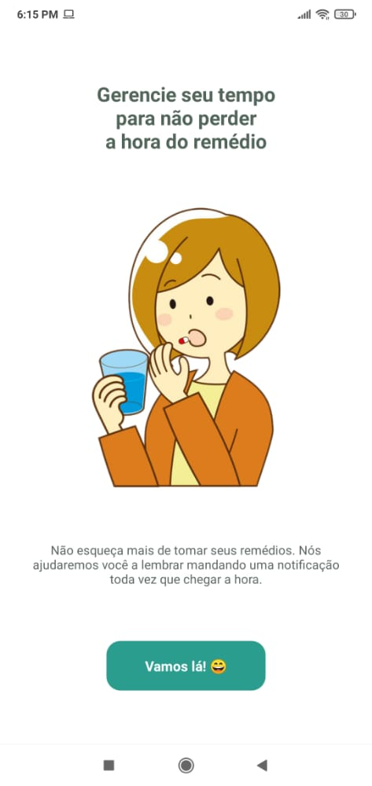
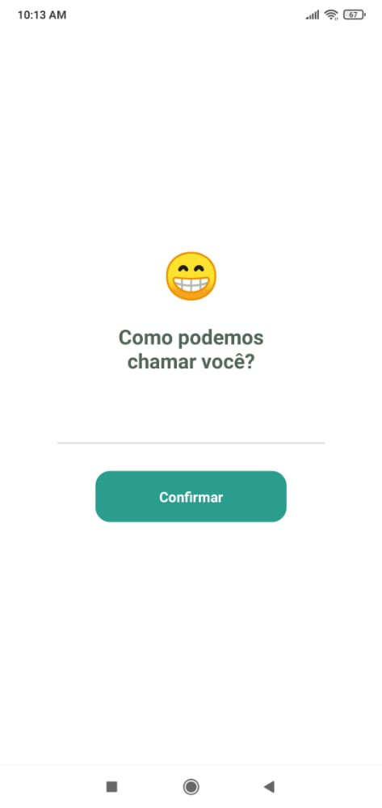
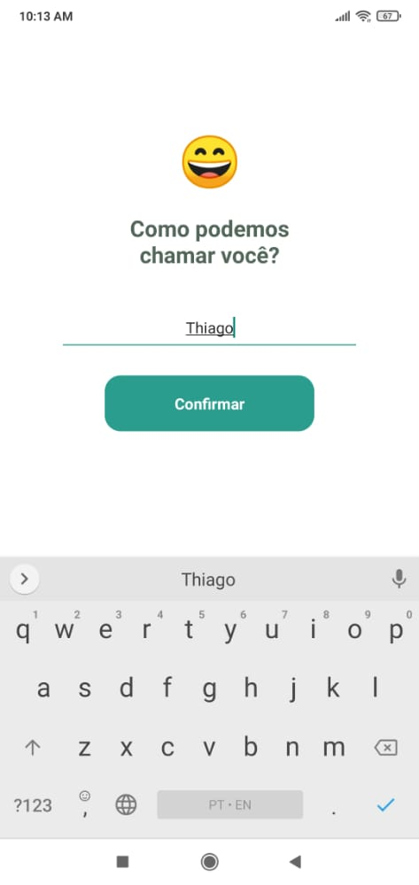

<h1 align="center">Medicine Time App</h1>

### :zap: Sobre:
Projeto feito para ajudar as pessoas mais esquecidos (com eu) a lembrar de tomar seus remédios. 
Download:
[Google Play](https://play.google.com/store/apps/details?id=com.medicinetime.app)

### :bookmark: Screenshots:

### :rocket: Tecnologias usadas:
- ReactNative
- Expo
- Typescript

### :bulb: Licensa:
Este projeto está sob a licensa MIT.
Clique [aqui](https://github.com/th1ag0-Zz/MedicineTime/blob/main/LICENSE) para mais detalhes.

---
Feito por Thiago Silva. :purple_heart: